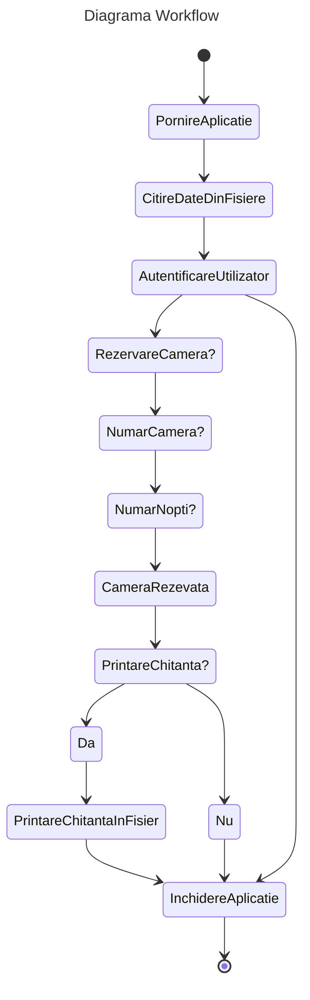
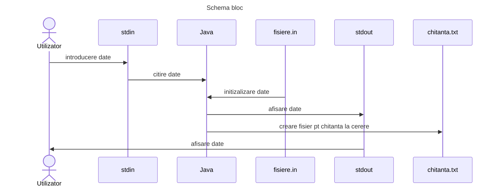

Pasi de utilizare:
Utilizatorul porneste aplicatia, sunt afisate toate camerele, hotelurile si preturile.
Se autentifica cu un email si dupa aceea vor aparea informatii despre el, cum ar fi "Numele",
"Bugetul".
Utilizatorul este intrebat daca vrea sa faca o rezervare la acel hotel, dupa la camera dorita,
iar mai apoi cate nopti doreste sa se cazeze.
Se va afisa daca camera a fost rezervata cu succes sau nu si dupa v a fi intrebat daca doreste
chitanta.